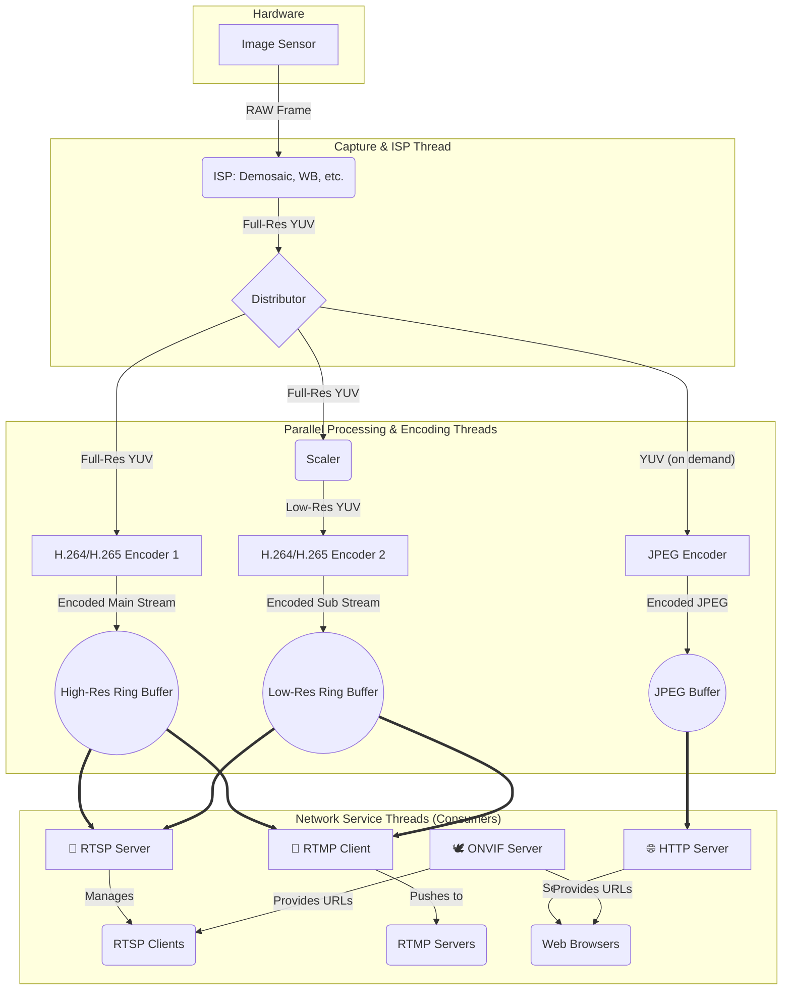

Thingino Streamer Architecture
==============================

The best flow for an IPC streamer is a **decoupled, multi-threaded pipeline architecture**. This model ensures that the high-priority task of video capture is never blocked by lower-priority network operations, leading to maximum stability and performance.

A single capture source that feeds multiple, parallel encoding and serving threads using thread-safe ring buffers.

### Core Principle: Capture Once, Distribute Everywhere

The central idea is to treat the video pipeline like an assembly line. Raw data comes in one end, gets processed and packaged, and then the finished products (encoded streams) are picked up by different delivery services (RTSP, RTMP, HTTP) without interfering with each other.

### Detailed Workflow

This diagram illustrates the optimal data flow, followed by an explanation of each stage.

#### Stage 1: Capture & ISP Thread (Highest Priority)

  * This thread's only job is to communicate with the hardware **Image Sensor**.
  * It grabs a raw video frame.
  * It performs Image Signal Processing (**ISP**) to convert the raw data into a clean, full-resolution YUV frame (a standard uncompressed video format).
  * It places this YUV frame into a shared memory structure for other threads to access.

#### Stage 2: Parallel Encoding Threads

This is where the work is divided. Multiple threads operate simultaneously on the YUV frames.

  * **Full-Size Stream Encoder:** A dedicated thread pulls the latest full-resolution YUV frame, encodes it into an **H.264 or H.265** NALU (Network Abstraction Layer Unit), and pushes the result into a `High-Res Ring Buffer`.
  * **Preview Stream Encoder:** Another thread pulls the full-resolution YUV frame, scales it down to the smaller preview size, encodes it, and pushes the result into a `Low-Res Ring Buffer`.
  * **JPEG Encoder:** This thread can be lazy. It only wakes up when the HTTP server requests a snapshot. It then grabs a YUV frame, encodes it into a JPEG, and places it in a simple buffer for the HTTP server to retrieve.

#### Stage 3: Network Service Threads (Consumers)

These threads are completely independent and simply consume the data from the ring buffers.

  * **RTSP Server:** Your existing `rtsp_server.c` code fits perfectly here.
      * When a client connects and requests the main stream (e.g., `rtsp://.../main`), it starts reading encoded packets from the `High-Res Ring Buffer` and sending them.
      * If a client requests the preview stream (e.g., `rtsp://.../sub`), it reads from the `Low-Res Ring Buffer`.
  * **RTMP Client:** This thread reads from either the high-res or low-res buffer (depending on configuration), wraps the NALUs into RTMP packets, and pushes them to external servers like YouTube, Twitch, or a central media server.
  * **HTTP Server:**
      * For snapshot requests (`/snapshot.jpg`), it triggers the JPEG encoder and serves the resulting image.
      * For the MJPEG stream (`/stream.mjpeg`), it repeatedly triggers the JPEG encoder and streams the images back to the browser using the `multipart/x-mixed-replace` content type.
  * **ONVIF Server:** This thread primarily handles discovery and metadata. It doesn't touch the video streams directly. Its main job is to tell other clients (like a VMS) the correct RTSP URLs for the main and sub streams.

### Why This Architecture is Best

1.  **Stability:** The high-priority capture thread is never delayed by a slow network client or a difficult encoding task. This prevents stuttering and frame drops at the source.
2.  **Efficiency:** Encoding for different resolutions happens in parallel, making full use of modern multi-core CPUs.
3.  **Modularity:** You can add or remove network services (e.g., add an SRT stream) without touching the core capture and encoding pipeline. You just add a new "consumer" thread that reads from the appropriate ring buffer.
4.  **Low Latency:** Ring buffers provide a highly efficient, low-overhead way for threads to share data without constant locking and unlocking, which is critical for real-time video.
