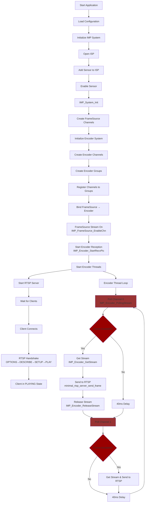

```mermaid
flowchart TD
    A[Start Application] --> B[Load Configuration]
    B --> C[Initialize IMP System]
    C --> D[Open ISP]
    D --> E[Add Sensor to ISP]
    E --> F[Enable Sensor]
    F --> G[IMP_System_Init]
    G --> H[Create FrameSource Channels]
    H --> I[Initialize Encoder System]
    I --> J[Create Encoder Channels]
    J --> K[Create Encoder Groups]
    K --> L[Register Channels to Groups]
    L --> M[Bind FrameSource → Encoder]
    M --> N[FrameSource Stream On<br/>IMP_FrameSource_EnableChn]
    N --> O[Start Encoder Reception<br/>IMP_Encoder_StartRecvPic]
    O --> P[Start Encoder Threads]
    P --> Q[Start RTSP Server]
    Q --> R[Wait for Clients]
    
    R --> S[Client Connects]
    S --> T[RTSP Handshake<br/>OPTIONS→DESCRIBE→SETUP→PLAY]
    T --> U[Client in PLAYING State]
    
    P --> V[Encoder Thread Loop]
    V --> W[Poll Channel 0<br/>IMP_Encoder_PollingStream]
    W --> X{Frame Available?}
    X -->|Yes| Y[Get Stream<br/>IMP_Encoder_GetStream]
    X -->|No| Z[40ms Delay]
    Y --> AA[Send to RTSP<br/>minimal_rtsp_server_send_frame]
    AA --> BB[Release Stream<br/>IMP_Encoder_ReleaseStream]
    BB --> CC[Poll Channel 1]
    Z --> CC
    CC --> DD{Frame Available?}
    DD -->|Yes| EE[Get Stream & Send to RTSP]
    DD -->|No| FF[40ms Delay]
    EE --> FF
    FF --> W
    
    style X fill:#990000
    style DD fill:#990000
    style W fill:#993333
    style CC fill:#993333
```