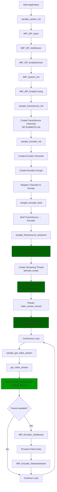

```mermaid
flowchart TD
    A[Start Application] --> B[sample_system_init]
    B --> C[IMP_ISP_Open]
    C --> D[IMP_ISP_AddSensor]
    D --> E[IMP_ISP_EnableSensor]
    E --> F[IMP_System_Init]
    F --> G[IMP_ISP_EnableTuning]
    G --> H[sample_framesource_init]
    H --> I[Create FrameSource Channels<br/>NO EnableChn yet]
    I --> J[sample_encoder_init]
    J --> K[Create Encoder Channels]
    K --> L[Create Encoder Groups]
    L --> M[Register Channels to Groups]
    M --> N[sample_encoder_bind]
    N --> O[Bind FrameSource → Encoder]
    O --> P[sample_framesource_streamon]
    P --> Q[IMP_FrameSource_EnableChn<br/>AFTER binding]
    Q --> R[Create Streaming Thread<br/>pthread_create]
    R --> S[sleep SLEEP_TIME<br/>Drop invalid frames]
    S --> T[Thread: video_stream_thread]
    T --> U[IMP_Encoder_StartRecvPic<br/>INSIDE thread]
    U --> V[Continuous Loop]
    V --> W[sample_get_video_stream]
    W --> X[get_video_stream]
    X --> Y[IMP_Encoder_PollingStream<br/>2000ms timeout]
    Y --> Z{Frame Available?}
    Z -->|Yes| AA[IMP_Encoder_GetStream]
    Z -->|No| BB[Continue Loop]
    AA --> CC[Process Frame Data]
    CC --> DD[IMP_Encoder_ReleaseStream]
    DD --> BB
    BB --> V
    
    style U fill:#006600
    style S fill:#006600
    style Q fill:#006600
    style Y fill:#009900
```