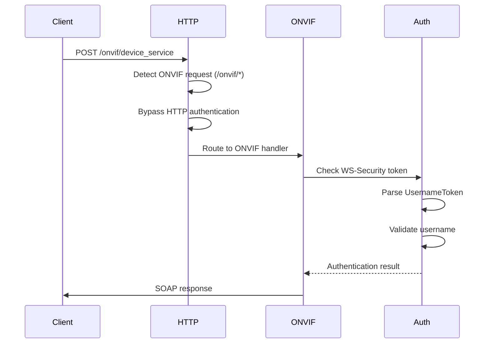
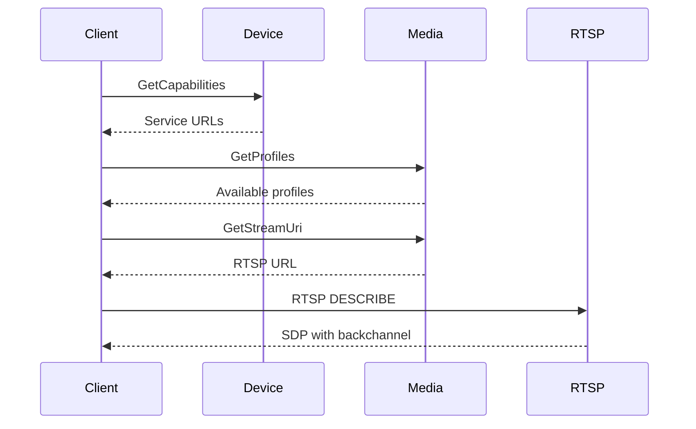

# ONVIF Implementation Guide

## Overview

This document describes the ONVIF (Open Network Video Interface Forum) implementation in Thingino Streamer, including authentication, services, and protocol compliance.

## Features Implemented

### Core ONVIF Services

#### Device Service (`/onvif/device_service`)
- **GetCapabilities** - Returns device and service capabilities
- **GetDeviceInformation** - Device manufacturer, model, firmware info
- **GetSystemDateAndTime** - Current system time and timezone
- **SystemReboot** - Remote device reboot functionality
- **GetServiceCapabilities** - Device service specific capabilities

#### Media Service (`/onvif/media_service`)
- **GetProfiles** - Available media profiles (video/audio configurations)
- **GetStreamUri** - RTSP stream URLs for profiles
- **GetSnapshotUri** - JPEG snapshot URLs
- **GetVideoSources** - Available video input sources
- **GetVideoEncoderConfiguration** - Video encoding parameters
- **GetServiceCapabilities** - Media service specific capabilities

#### Event Service (`/onvif/event_service`)
- **GetServiceCapabilities** - Event service capabilities (basic implementation)

#### Imaging Service (`/onvif/imaging_service`)
- **GetOptions** - Available imaging parameters (brightness, contrast, saturation, sharpness)

#### PTZ Service (`/onvif/ptz_service`)
- **GetServiceCapabilities** - PTZ capabilities (indicates no PTZ support)

### Authentication

#### WS-Security (Primary Method)
- **UsernameToken** authentication in SOAP headers
- **PasswordDigest** support with nonce and timestamp
- **Username validation** against ONVIF configuration
- **ONVIF Profile S compliant**

#### HTTP Basic Authentication (Fallback)
- **RFC 2617 compliant** Basic authentication
- **Base64 encoded** credentials
- **Backward compatibility** with non-ONVIF clients

### RTSP Audio Backchannel

#### Protocol Support
- **ONVIF backchannel extensions** in RTSP
- **SDP generation** with backchannel streams
- **Require header validation** (`www.onvif.org/ver20/backchannel`)

#### Audio Codecs
- **G.711 (PCMU)** - 8kHz, 64kbps
- **G.726-16** - 8kHz, 32kbps
- **Bidirectional audio** - downstream and upstream

## Configuration

### ONVIF Module Configuration (`/etc/streamer.d/onvif.json`)

```json
{
  "enabled": true,
  "auth": {
    "enabled": true,
    "username": "thingino",
    "password": "thingino",
    "localhost_bypass": true
  },
  "device_name": "Thingino Camera",
  "device_location": "Embedded",
  "manufacturer": "Thingino",
  "model": "Streamer",
  "serial_number": "123456789",
  "firmware_version": "1.0.0",
  "hardware_id": "thingino-hw1"
}
```

### HTTP Module Integration

The HTTP module automatically bypasses its own authentication for ONVIF requests (`/onvif/*` paths), allowing the ONVIF module to handle authentication according to ONVIF standards.

## Client Compatibility

### Tested Clients
- **TinyCam Monitor Pro** - Full compatibility
- **ONVIF Device Manager** - Basic compatibility
- **VLC Media Player** - RTSP streaming

### Expected Client Behavior
1. **Discovery** - WS-Discovery probe/match
2. **Authentication** - WS-Security or Basic Auth
3. **Capabilities** - GetCapabilities request
4. **Media Setup** - GetProfiles, GetStreamUri
5. **Streaming** - RTSP connection with optional backchannel

## Protocol Compliance

### ONVIF Standards
- **ONVIF Profile S** - Streaming profile compliance
- **WS-Discovery 1.1** - Device discovery
- **SOAP 1.2** - Web services messaging
- **WS-Security 1.0** - Authentication and security

### RTSP Extensions
- **RFC 2326** - Real Time Streaming Protocol
- **ONVIF Streaming Specification** - Backchannel extensions
- **SDP Extensions** - Audio backchannel description

## Architecture

### Module Structure
```
src/modules/onvif/
├── onvif_module.c      # Module initialization and HTTP routing
├── onvif_services.c    # SOAP service implementations
├── onvif_discovery.c   # WS-Discovery implementation
└── onvif_module.h      # Public interface
```

### Integration Points
- **HTTP Module** - Route registration and authentication bypass
- **RTSP Module** - Backchannel SDP generation and handling
- **Auth Utils** - WS-Security and Basic authentication
- **Frame Manager** - Video source integration

## Troubleshooting

### Common Issues

#### Authentication Failures
- Verify credentials in `onvif.json`
- Check WS-Security token format
- Ensure client sends proper SOAP headers

#### Missing Routes (404 Errors)
- Check HTTP router registration
- Verify ONVIF module is enabled
- Review available routes in debug logs

#### RTSP Backchannel Issues
- Confirm client sends `Require: www.onvif.org/ver20/backchannel`
- Check SDP generation for backchannel streams
- Verify audio codec support

### Debug Logging

Enable debug logging to troubleshoot issues:
```bash
# View ONVIF requests and authentication
journalctl -f | grep -E "(ONVIF|AUTH_UTILS|HTTP_ROUTER)"
```

## Future Enhancements

### Planned Features
- **PTZ Control** - Pan/tilt/zoom operations
- **Event Notifications** - Motion detection events
- **Audio Streaming** - Bidirectional audio implementation
- **Advanced Imaging** - Full imaging service implementation
- **WS-Discovery** - Complete discovery service

### Performance Optimizations
- **SOAP Response Caching** - Cache static responses
- **Connection Pooling** - Reuse HTTP connections
- **Memory Management** - Optimize SOAP parsing

## Implementation Details

### Authentication Flow



### Service Discovery Flow



## References

- [ONVIF Profile S Specification](https://www.onvif.org/profiles/profile-s/)
- [ONVIF Application Programmer's Guide](doc/onvif/ONVIF_WG-APG-Application_Programmers_Guide-1.txt)
- [WS-Security 1.0 Specification](https://www.oasis-open.org/committees/wss/)
- [RTSP RFC 2326](https://tools.ietf.org/html/rfc2326)
